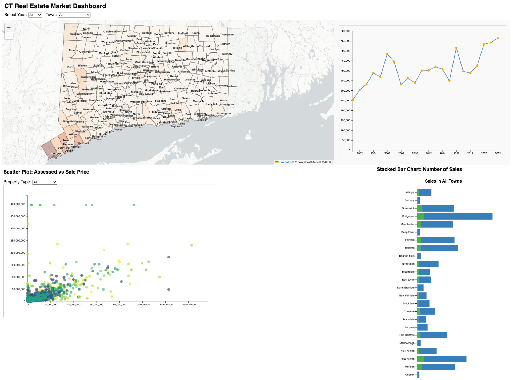

# Navigating Connecticut’s Real Estate Landscape (2002–2022)

## Group Members
- Ranran Hu
- FatemaZai Khan
- Edha N Shah
- Jayanth Mekala

---

## Overview

This project presents an interactive dashboard built with D3.js that explores residential real estate trends across Connecticut from 2002 to 2022. It includes four linked visualizations that allow users to examine sale prices, price assessments, market distribution by property type, and investment potential per town.

---

## How to Run

1. Open the HTML file named `combinationGraph.html` in a modern browser (preferably Chrome).
2. Ensure all associated JavaScript files (`scatterScript.js`, `stackedChart.js`, `mapLineScript.js`) and data files (`town_data_cleaned.csv`, `CTDOT_Municipalities.geojson`, `d3.v7.js`, `main.js`, `lib folder`) are in the same directory.
3. Interact with dropdowns or the choropleth map to explore the dataset.

---

## How to Read the Visualization

### 1. **Choropleth Map**
- **Encoding**: Color intensity represents average sale price, Sales Ratio, Growth Rate of Sale Price per town.
- **Interactions**:
    - Year Selection: Dynamically update the map, trends, scatter plots and Stacked chart to display different years' property data.
    - Town Selection: Dynamically update the map, trends, scatter plots and Stacked chart to display different towns' property data.
    - Tooltip on Hover: Instantly reveal detailed town-specific data without clutter.
    - Zoom and Pan: Explore different towns and regions through smooth zooming and panning interactions.
- **Task**: Identify high- or low-performing real estate regions across Connecticut.

### 2. **Property Price Trends (Line Chart)**
- **X-axis**: Year (2002–2022)
- **Y-axis**: Average Sale Price (USD)
- **Encoding**: Line plot with circles representing annual average prices.
- **Interactions**:
  - Dropdown or map click selects town.
  - Hover over data points for detailed tooltips (year, price).
  - Axis scales dynamically based on selection.
- **Use Case**: Reveal long-term growth, volatility, or recent changes in price trends per town.

### 3. **Scatter Plot of Assessed vs. Sale Price**
- **X-axis**: Assessed Property Value
- **Y-axis**: Actual Sale Price
- **Color**: Year of sale, using a continuous color gradient
- **Encoding**: Each dot is a property sale; proximity to diagonal line suggests over- or underpricing.
- **Interactions**:
    - Filter by Year, Town, and Property Type (Residential vs Commercial).
    - Hover shows details: Town, Year, Type, Assessed Value, Sale Price.
- **Use Case**: Evaluate pricing fairness, identify outliers, and compare valuation accuracy.

### 4. **Stacked Bar Chart: Number of Sales**
- **Y-axis**: Town
- **X-axis**: Total Number of Sales
- **Encoding**:
    - 🟩 Green bar for Residential
    - 🟦 Blue bar for Commercial
- **Interactions**:
    - Filters by Year and Town.
    - Hover shows exact count of each sale type.
- **Use Case**: Understand market composition, compare town activity levels, and explore commercial vs residential market shares.

---

## Screenshot

Below is a screenshot of the interactive dashboard interface:

*If the image does not display, please ensure `screenshot.png` is placed in the same folder.*

---

## Notes

- All charts are interconnected. Selections in one will filter others.
- Tooltips provide detailed context for every element on hover.
- Designed to support real estate exploration, investment comparison, and price pattern discovery.

